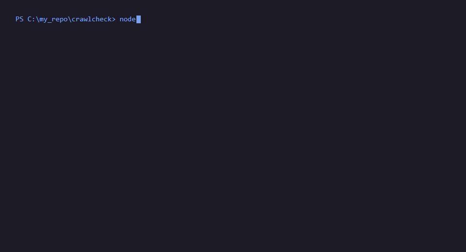
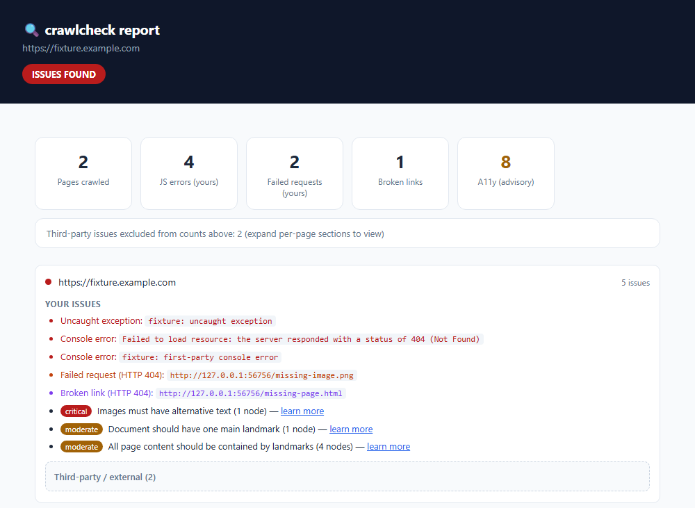

# crawlcheck

[](https://github.com/jabeer4148-ops/crawlcheck/actions/workflows/test.yml)

**Catch what's actually your fault — not third-party noise.**

crawlcheck crawls your site in a real Chromium browser and reports JavaScript errors, failed requests, broken links, and accessibility issues. It separates **first-party problems** (your code, your links) from **third-party noise** (analytics scripts, ad trackers, CDN hiccups) so you can trust the signal.

```bash
npx crawlcheck https://example.com
```

One command. HTML report. No config file.





See a full interactive example: [docs/sample-report.html](docs/sample-report.html).

## What it catches

| Category | What it means |
| --- | --- |
| **JS errors** | `console.error` output and uncaught exceptions |
| **Failed requests** | HTTP 4xx/5xx responses and requests that never completed |
| **Broken links** | `<a href>` targets that return errors (401/403 auth-gated links are skipped) |
| **Accessibility** | [axe-core](https://github.com/dequelabs/axe-core) violations — **advisory by default** |

### First-party vs third-party

By default, summary counts and exit codes use **first-party issues only**. Third-party console errors and failed requests (e.g. a broken Optimizely or analytics script) are collected but tucked into a collapsible **"Third-party / external"** section in the report.

Use `--include-third-party` if you want those counted toward totals and the exit code.

## Usage

```bash
npx crawlcheck <url> [options]
```

| Option | Description | Default |
| --- | --- | --- |
| `--max <n>` | Max pages to crawl | `25` |
| `--depth <n>` | Max link depth from the start URL | `2` |
| `--out <file>` | HTML report path | `crawlcheck-report.html` |
| `--json <file>` | Also write raw results as JSON | — |
| `--no-a11y` | Skip accessibility checks (faster) | — |
| `--strict` | Treat a11y violations as failures (exit code 1) | off |
| `--include-third-party` | Count third-party JS/request issues toward exit code | off |
| `--timeout <ms>` | Per-page navigation timeout | `15000` |

### Examples

```bash
# Quick check — a11y is advisory, third-party noise excluded
npx crawlcheck https://example.com

# Fail CI on accessibility too
npx crawlcheck https://staging.example.com --strict

# Also fail on third-party script errors
npx crawlcheck https://staging.example.com --include-third-party

# Fast crawl, JSON output for scripting
npx crawlcheck https://example.com --json results.json --no-a11y
```

## Exit codes

| Code | Meaning |
| --- | --- |
| `0` | No first-party JS errors, uncaught exceptions, failed requests, or broken links |
| `1` | One or more of the above were found |

**Accessibility violations do not affect the exit code by default** — they appear in the report as advisory. Pass `--strict` to fail on a11y too.

Even simple sites can trigger advisory a11y findings (e.g. missing landmark regions on `example.com`). That is expected axe behavior, not a sign your site is broken.

```yaml
# Example GitHub Action step
- run: npx crawlcheck https://staging.example.com --max 30 --strict
```

## Requirements

- Node.js 18+
- Chromium (~150 MB) — downloaded automatically on first `npm install` / `npx` run via Playwright

## How it works

crawlcheck uses [Playwright](https://playwright.dev) to drive Chromium and [@axe-core/playwright](https://github.com/dequelabs/axe-core-npm) for accessibility. It crawls same-origin links up to your depth/max limits, probes link targets with HEAD (falling back to GET on 405), and writes a self-contained HTML report.

## License

MIT
